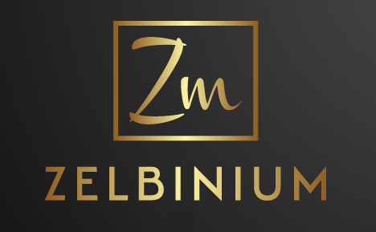

<!--div style="margin-bottom: 10px; background-color: green; font-size: larger; padding: 10px;">
  For a healthier digital for our children, support <em>Zelbinium</em> !
  <a style="display: flex; width: 100;" href="./donate">
    Donate
  </a>
</div-->

*Zelbinium* aims to make programming freely accessible to as many people as possible, whatever their level and the devices they use. 

Easily create applications with a real graphical interface and accessible from any device with a modern web browser connected to the Internet, including smartphones and tablets.

Simply launch your application and use the automatically generated link to share access with the people you want, without having to deploy your application on a remote server or configure your box or internet router.

This site is under construction and, in its current version, only available [in French](/fr/). In a future version, this site will also be in English (or even in other languages). Contributions are welcome at <https://github.com/epeios-q37/zelbinium>.