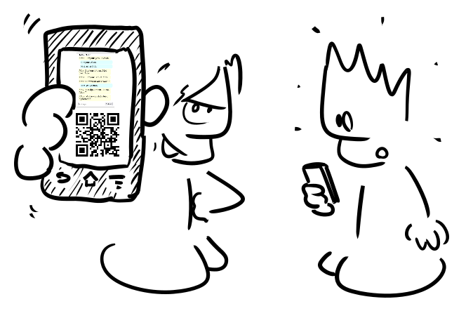
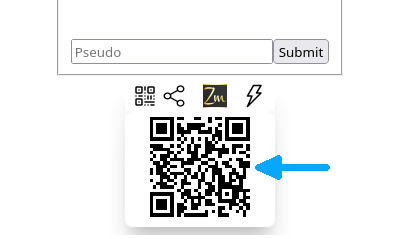
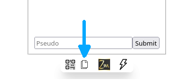

# *Action!*

In this section of the site, we'll see how to perform various actions related to an application and its source code directly from a web browser. The starting point will be an insert like this one:

  
Hide/show

<iframe style="width: 100%; height: 80vh;" src="https://faas.q37.info/brython?demo=Messages">
</iframe>

 

Click on *Hide/show* to display it.

The application used as an example in this section lets you exchange messages with anyone just by having them scan the QR code generated by the application with their smartphone (more details will be given below).

    
    

        Created with 
        <a href="https://framalab.org/gknd-creator/" target="_blank">
            <em>GéGé</em></a>.
    

In the sections below, you'll be invited to perform various actions in a insert like the one at the top of the page.

## Launching an application

To launch the application, simply click on the *Run* button. This will hide the source code editor and, after a variable amount of time depending on the complexity of the application, the application interface will be displayed. By clicking on *Code*, you can hide/show the application's source code.

  
Hide/show

  <iframe style="width: 100%; height: 80vh;" src="https://faas.q37.info/brython?demo=Messages">
  </iframe>

 

## Sharing the access to an application

Let's see how to share the access to an application so that several people can use it at the same time, each with their own device (smartphone, tablet, personal computer…).

As seen above, click on *Show/Hide* to display the insert, then click the *Run* button to launch it and wait for it to appear.

  
Hide/show

  <iframe style="width: 100%; height: 80vh;" src="https://faas.q37.info/brython?demo=Messages">
  </iframe>

 

At the very bottom, the following icons will appear:

Clicking on the icon indicated by the arrow will display the following:

Here we see a [QR code](https://en.wikipedia.org/wiki/QR_code), indicated by the arrow. Clicking on it opens another tab, which also gives access to the application. By switching from one tab to another, you'll see that messages written in one tab will also be displayed in the other. More than two tabs can be opened simultaneously.

To chat with someone nearby, simply have them scan the QR code with their devices (smartphone, tablet…). This will give them access to the application. You'll then be able to exchange messages, each with his or her own device.

To exchange messages with someone who can't scan the QR code, either because they're not nearby, or because it's not possible or too complicated with their device, you can still give them access to the app.

To do so, simply click on the icon indicated by the arrow. You will then be able to share the access to the application in the same way as you would share a video, a photo, a link…

Some devices, or browsers, may not offer this sharing facility. You will then see the following:

By clicking on the icon indicated by the arrow, a link is then copied to the clipboard, making it easy to send it, by e-mail or any other messaging application. By opening this link in the web browser, which should happen automatically when the link is clicked, the recipient of the message can access the application as if he or she had scanned the QR code.

On mobile devices, you can also press and hold the QR code to bring up a menu offering the possibility of sharing the link of the application.

All the sharing features presented on this page are automatically available for all *Zelbinium* applications, whether those available on this site, or those you create yourself.

## Exploring an application’s source code

The [source code](https://en.wikipedia.org/wiki/Source_code) of an application is the list of instructions that make up the application. This source code can be broken down into several files.

For ease of use, all the applications on this site are contained in a single file. Simply click in the editor (after clicking on *Code* if the latter is hidden) to move through the source code and explore it.

  
Hide/show

  <iframe style="width: 100%; height: 80vh;" src="https://faas.q37.info/brython?demo=Messages">
  </iframe>

## Modifying an application’s source code

By unchecking the *Read-only* box, you'll be able to modify the application's source code directly in the editor. By clicking on *Run*, the modified version of the application will be launched.

  
Hide/show

  <iframe style="width: 100%; height: 80vh;" src="https://faas.q37.info/brython?demo=Messages">
  </iframe>

<!--
## Creating your own application
-->

To take things a step further, the [*Inspiration*](../../inspiration/) section contains other applications that you can explore and modify as you like…