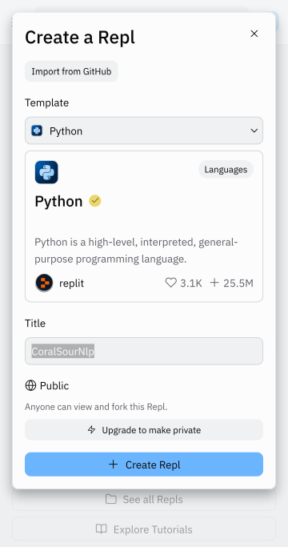
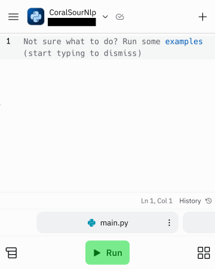

# Creating your own application

Creating an application in *Replit* means creating a *repl* containing the files corresponding to the application's source code.

To do this, go to https://replit.com and, if you haven't already done so, log into your account. Click on the *Create Repl* button, and a popup window will appear.

In this *popup*, in the *Template* field, select the language you wish to program in, in this case *Python*, change the name of the *repl* in the *Title* field if required, then click on the *Create Repl* button.

You're now in the development environment, and you can start writing the lines of code for the new application and launch it by clicking on the *Run* button.

To continue, there are many applications on this site in the [*Inspiration* section](../../inspiration/) that can be used as a basis for creating your own applications.
