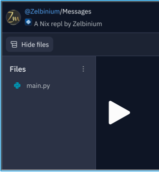
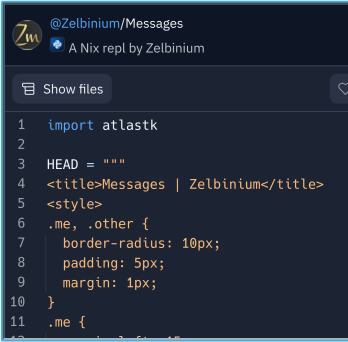

# Exploring an application's source code

The [source code](https://en.wikipedia.org/wiki/Source_code) of an application is the list of instructions that make up the application. This source code can be broken down into several files.

<iframe style="margin: auto; border: groove 10px; padding: 5px;" src="https://replit.com/@Zelbinium/Messages?embed=true" width="500" height="360"></iframe>

By clicking on  *Show files* (<svg width="16" height="16" viewBox="0 0 24 24" fill="currentColor" aria-hidden="true" ><path fill-rule="evenodd" clip-rule="evenodd" d="M2.25 4.5C2.25 3.25736 3.25736 2.25 4.5 2.25H19.5C20.7426 2.25 21.75 3.25736 21.75 4.5V7.5C21.75 8.07627 21.5334 8.60193 21.1771 9C21.5334 9.39807 21.75 9.92373 21.75 10.5V13.5C21.75 14.0763 21.5334 14.6019 21.1771 15C21.5334 15.3981 21.75 15.9237 21.75 16.5V19.5C21.75 20.7426 20.7426 21.75 19.5 21.75H8.5C7.25736 21.75 6.25 20.7426 6.25 19.5V16.5C6.25 15.9237 6.46664 15.3981 6.82292 15C6.46664 14.6019 6.25 14.0763 6.25 13.5V10.5C6.25 10.237 6.29512 9.98458 6.37803 9.75H4.5C3.25736 9.75 2.25 8.74264 2.25 7.5V4.5ZM19.5 8.25C19.9142 8.25 20.25 7.91421 20.25 7.5V4.5C20.25 4.08579 19.9142 3.75 19.5 3.75H4.5C4.08579 3.75 3.75 4.08579 3.75 4.5V7.5C3.75 7.91421 4.08579 8.25 4.5 8.25H19.5ZM8.5 9.75C8.08579 9.75 7.75 10.0858 7.75 10.5V13.5C7.75 13.9142 8.08579 14.25 8.5 14.25H19.5C19.9142 14.25 20.25 13.9142 20.25 13.5V10.5C20.25 10.0858 19.9142 9.75 19.5 9.75H8.5ZM19.5 15.75H8.5C8.08579 15.75 7.75 16.0858 7.75 16.5V19.5C7.75 19.9142 8.08579 20.25 8.5 20.25H19.5C19.9142 20.25 20.25 19.9142 20.25 19.5V16.5C20.25 16.0858 19.9142 15.75 19.5 15.75Z"></path></svg> button if text is not displayed), the list of application files will be displayed. For the application used as an example, there is only one file.

This file is *main.py* (it may take a few seconds before it appears). To view its contents, simply click on its name. 

The file list may remain displayed, reducing the file display area. The *Show files* button is then renamed *Hide files* (if text is displayed). Clicking on it hides the file list panel, with the file displayed occupying the full width of the insert.

The next page, [*Modify*](../modify/), shows how to modify an application's source code.

