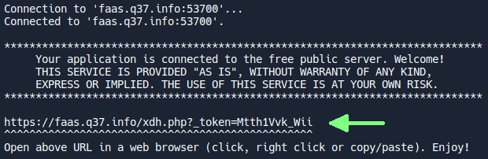

# Launching an application

Here we'll see how to launch an application, in this case a small application for exchanging messages between several people.

<iframe style="margin: auto; border: groove 10px; padding: 5px;" src="https://replit.com/@Zelbinium/Messages?embed=true" width="500" height="360"></iframe>

By clicking on the Run button in the top right-hand corner, or on the <svg preserveAspectRatio="xMidYMin" width="16" height="16" viewBox="0 0 24 24" fill="white" style="background-color: black;"><path d="M20.5929 10.9105C21.4425 11.3884 21.4425 12.6116 20.5929 13.0895L6.11279 21.2345C5.27954 21.7033 4.24997 21.1011 4.24997 20.1451L4.24997 3.85492C4.24997 2.89889 5.27954 2.29675 6.11279 2.76545L20.5929 10.9105Z"/></svg> symbol, text will scroll until the following is displayed:

By clicking on the [URL](https://en.wikipedia.org/wiki/URL) indicated by the arrow, a new tab will be opened giving access to the application. Here you can enter a pseudonym, then messages that will be visible to all users of this application.

The displayed URL will not be exactly the same as the one shown above, and will change each time the application is relaunched.

In some circumstances, clicking on the *Run* button has no effect, so you have to click on <svg preserveAspectRatio="xMidYMin" width="16" height="16" viewBox="0 0 24 24" fill="white" style="background-color: black;"><path d="M20.5929 10.9105C21.4425 11.3884 21.4425 12.6116 20.5929 13.0895L6.11279 21.2345C5.27954 21.7033 4.24997 21.1011 4.24997 20.1451L4.24997 3.85492C4.24997 2.89889 5.27954 2.29675 6.11279 2.76545L20.5929 10.9105Z"/></svg>.

see how to share the access to the application with other people.

