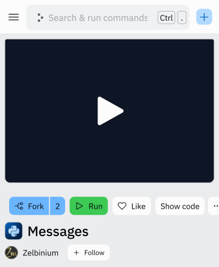
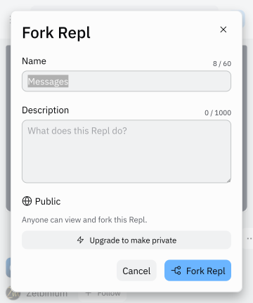
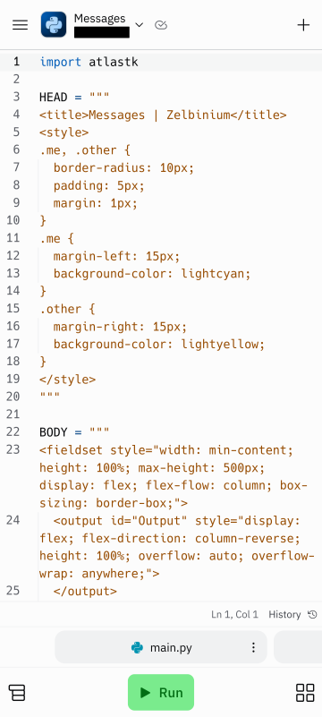

# Modifying an application's source code

As explained on this [page](../../resources/replit/), applications on *Replit* are stored in a *repl*. So, unless you're the owner of the *repl*, to modify an application, you need to *fork* the corresponding *repl*. *Forking* consists in making a copy of the entire contents of a *repl*, so as to be able to manipulate this *repl* at will without impacting the original *repl*.

If you haven't already done so, go to https://replit.com to log into your *Replit* account, then return to this page.

<iframe style="margin: auto; border: groove 10px; padding: 5px;" src="https://replit.com/@Zelbinium/Messages?embed=true" width="500" height="360"></iframe>

To proceed with the actual *fork*, click on the *Open on Replit* button at the top right (or on the link <a href="https://replit.com/@Zelbinium/Messages" target="_blank">https://replit.com/@Zelbinium/Messages</a>). This will open a new tab.

In this new tab, there's a button labeled *Fork*. Clicking it while connected to a *Replit* account will open a popup in which you can change the name of the *repl* (you can leave the value already present, which is the original name of the *repl*) then confirm the *fork* by clicking on the *Fork repl* button.

From this point on, you have access to the development environment itself, which displays the source code of the application contained in the *repl*. You can modify the source code as you wish, and run the modified version by clicking on the *Run* button.

This site offers a number of applications hosted on *Replit* ([*Inspiration* section](../../inspiration/)) which you can modify as described here.

The last page of this section, [*Create*](../create), shows you how to create a *repl* for your own application.

