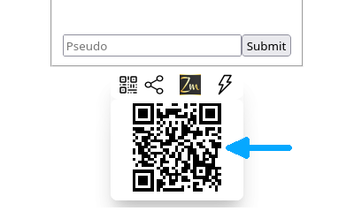

# Sharing access to an application

Let's see how to share access to an application so that several people can use it at the same time.

As seen on the [*Launch*](../launch) page, launch the application and access it by clicking on the URL.

<iframe style="margin: auto; border: groove 10px; padding: 5px;" src="https://replit.com/@Zelbinium/Messages?embed=true" width="500" height="360"></iframe>

At the very bottom, the following icons will appear:

Clicking on the icon indicated by the arrow will display the following:

Here we see a [QR code](https://en.wikipedia.org/wiki/QR_code), indicated by the arrow. Clicking on it opens another tab, which also gives access to the application. By switching from one tab to another, you'll see that messages written in one tab will also be displayed in the other. More than two tabs can be opened simultaneously.

To chat with someone nearby, simply have them scan the QR code with their devices (smartphone, tablet…). This will give them access to the application. You'll then be able to exchange messages, each with his or her own device.

To exchange messages with someone who can't scan the QR code, either because they're not nearby, or because it's not possible or too complicated with their device, you can still give them access to the app.

To do so, simply click on the icon indicated by the arrow.You will then be able to share the access to the application in the same way as you would share a photo or a link.

Some devices, or browsers, may not offer this sharing facility. You will then see the following:

By clicking on the icon designated by the arrow, a link is then copied to the clipboard, making it easy to send it, by e-mail or any other messaging application. By opening this link in the web browser, which should happen automatically when the link is clicked, the recipient of the message can access the application as if he or she had scanned the QR code.

When the application is relaunched, its link will change, so the corresponding QR code will have to be scanned again, or the new link sent.

All the sharing features presented on this page are automatically available for all *Zelbinium* applications, whether those available on this site, or those you create yourself.

Let's move to the [*Explore*](../explore/) page to see how to view the [source code](https://en.wikipedia.org/wiki/Source_code) of an application.

