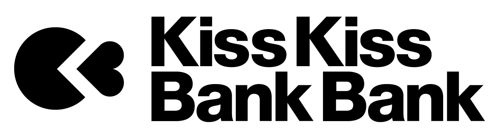

# Why donate?

With *Zelbinium*, your children can have fun using their smartphones to create real [connected applications](https://en.wikipedia.org/wiki/Web_application). By spending less time on social media, and using the sharing facilities offered by *Zelbinium* to exchange views on their creations, your children will be less exposed to the all-too-often tragic [drifts](https://en.wikipedia.org/wiki/Cyberbullying) that make the headlines.

*Zelbinium* could not exist without the [*Atlas* toolkit](../resources/atk/), a world-class innovation in *cloud computing*. Your donations will be used primarily to finance the resources needed to consolidate the quality of the service. The remainder will be devoted to improving the form and content of the site, so as to offer young people the opportunity to acquire a better understanding and mastery of the digital world, as well as new perspectives for their professional future.

For any questions: [contact page](../contact).

  <table style="display: inline-block; align-content: center;">
    <tr>
      <td style="border: none; padding: 0px; padding-right: 10px;">
        <b>Supprt <em>Zelbinium</em></b>: 
      </td>
      <td>
        
        <noscript>
          <a href="https://liberapay.com/Epeios/donate">
          
        </noscript>
        </a>
      </td>
      <td style="vertical-align: middle;">
        <a style="display: flex;" href="https://github.com/sponsors/epeios-q37">
          </img>
        </a>
      </td>
      <td>
        <a href="https://donate.stripe.com/7sIcOq9Cm7sc5RS000">
          stripe
        </a>
      </td>
      <td style="vertical-align: middle;">
        <a style="display: flex;" href="https://www.kisskissbankbank.com/en/projects/zelbinium">
          </img>
        </a>
      </td>
    </tr>
  </table>

