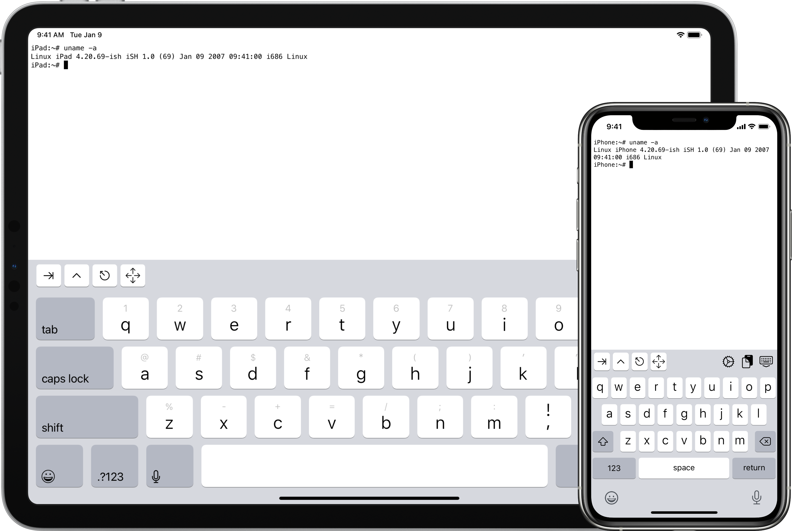

# *iSH*

[*iSH*](https://ish.app/) is a *Linux* *shell* for *iOS* (and derivatives) in which you can install a *Python* interpreter.  This means you can run *Python* applications directly on your *iPhone* or *iPad*, without having to use *Replit*.

If you have a personal computer, you can install a *Python* development environment on it to develop your applications, and drop them in a software forge to easily retrieve and run them on your *Apple* smartphone or tablet using *iSH*.

[*Termux*](../termux) is the equivalent for smartphones and tablets under *Android*.