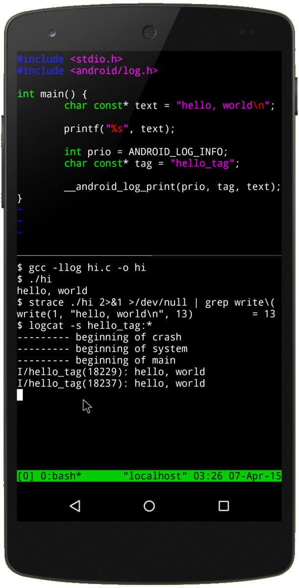

# *Termux*

[*Termux*](https://termux.dev/) is a terminal emulator for *Android* in which you can install a *Python* interpreter. This means you can run *Python* programs directly on your *Android* smartphone or tablet, without having to use *Replit*.!

If you have a personal computer, you can install a *Python* development environment on it to develop your applications, and drop them in a [software forge](../forges) to easily retrieve and run them on your *Android* smartphone or tablet using *Termux*.

[*iSH*](../ish) is the equivalent for *Apple* smartphones and tablets.