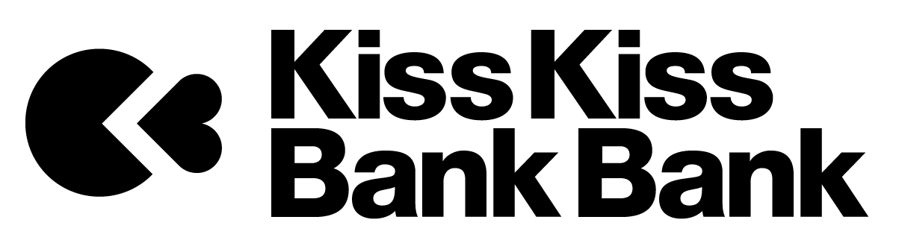

# Your support makes a difference

With *Zelbinium*, instead of spending their time on video games or social media, with all the risks of addiction that entails, your children will use their smartphones to create their own applications. By making it easy to share their creations, *Zelbinium* will give your kids the opportunity to forge new bonds with their peers, reducing the risk of cyberbullying while stimulating their creativity.

  <table id="support" style="width: fit-content; margin: auto;">
    <tr>
      <td colspan="2" style="border: none; text-align: center;">
        <b>Support <em>Zelbinium</em></b>: 
    </td>
    </tr>
    <tr>
      <td>
        
        <noscript>
          <a href="https://liberapay.com/Epeios/donate">
          
        </noscript>
        </a>
      </td>
      <td style="vertical-align: middle;">
        <a style="display: flex;" href="https://github.com/sponsors/epeios-q37">
          </img>
        </a>
      </td>
    </tr>
    <tr>
      <td>
        <a href="https://donate.stripe.com/7sIcOq9Cm7sc5RS000">
          stripe
        </a>
      </td>
      <td style="vertical-align: middle;">
        <a style="display: flex;" href="https://www.kisskissbankbank.com/en/projects/zelbinium">
          </img>
        </a>
      </td>
    </tr>
  </table>

---

Are you afraid your child is spending too much time on his/her smartphone? Are you worried about addiction, or about exposing him/her to the all-too-often dramatic [drifts](https://en.wikipedia.org/wiki/Cyberbullying) that make the headlines?

*Zelbinium* is the easiest way for your kids to create real [connected applications](https://en.wikipedia.org/wiki/Web_application), accessible via a [QR code](https://en.wikipedia.org/wiki/Web_application) or a simple link sent by [e-mail](https://en.wikipedia.org/wiki/Email) or [instant messaging](https://en.wikipedia.org/wiki/Instant_messaging).

These applications are usable <u>on</u> smartphones, and can be created <u>with</u> a smartphone, which makes *Zelbinium* particularly attractive to young people, prompting them to spend less time on video games or social media. Unlike the latter, *Zelbinium* stimulates your children's creativity and therefore doesn't present the same risks of addiction.

What's more, by making their creations easily accessible via social media, *Zelbinium* also changes the nature of our children's exchanges, and will clean up their content, reducing the risk of cyberbullying.

The l[anguage used in *Zelbinium*](https://en.wikipedia.org/wiki/Python_(programming_language)) is widely used in professional and educational fields. The knowledge acquired with *Zelbinium* can be used by your children outside *Zelbinium*, during their studies or in their future professional lives.

*Zelbinium* is also based on [web technologies](https://en.wikipedia.org/wiki/HTML5), which are extremely widespread and well-documented, able to manage images, sounds, videos, music, animations... Therefore, *Zelbinium* will also enable your children to unleash their creativity in fields other than programming.

Several children can work together on the same application. Depending on their affinities, some will be in charge of programming, others of sound, still others of graphics... allowing them to discover teamwork while having fun.

Thanks to *Zelbinium*, your children will develop programming skills and digital literacy in general, while strengthening their bonds with their peers through group work.

In today's ubiquitous digital world, the knowledge acquired in this way will be useful to your children in both their personal and professional lives, whether or not their profession is directly linked to IT.

What makes it unique is the ease with which *Zelbinium* lets you create and share smartphone-adapted applications, enabling users to interact easily each from their own smartphone.

*Zelbinium*'s uniqueness is only possible thanks to the use of the [*Atlas* toolkit](https://atlastk.org/), a world-class innovation in cloud computing, and is [*libre* software](https://en.wikipedia.org/wiki/Free_software).

This website shows, through its [*Action!*](../action/) section, how, in just a few clicks, launch, share, explore, modify and create an application using your smartphone.

The [*Inspiration*](../inspiration/) section of the same site gives examples of applications that can be directly accessed and modified by following the instructions in the *Action!* section.

All the applications on *Zelbinium* are suitable not only for smartphones, but also for tablets and personal computers. No reason not to get started right away!

As a software engineer, I developed the *Atlas* toolkit in my spare time, but my mainly technical skills, my availability and my financial means are no longer sufficient. Between renting servers and bandwidth, the resources needed to promote the project and to define and develop tools to facilitate the use of *Zelbinium* in actions aimed at young people... your support is just essential to ensure the lasting and development of *Zelbinium*.

You can also help by spreading the word about *Zelbinium*, especially to those who work with your children. This project is also an opportunity to share moments of complicity with your child, by accompanying him or her as they discover *Zelbinium*.

Other projects dedicated to digital inclusion are currently being studied, and are only possible thanks to the service at the heart of *Zelbinium*, because nothing else like it exists in the world.

Together, let's build a healthier digital environment for our children, and offer them new career opportunities in a rapidly expanding field.

  
    <a style="margin: auto; background-color: white; color: green; border-radius: 20px; font-family: sans-serif; font-weight: bold; padding: 5px 30px; margin: 10px auto" href="#support">
      Support <em>Zelbinium</em>!
    </a>
  

