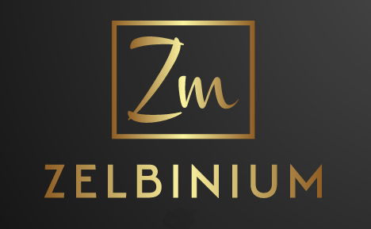

<!--div style="margin-bottom: 10px; background-color: green; font-size: larger; padding: 10px;">
  Pour un numérique plus sain pour nos enfants, soutenez <em>Zelbinium</em> !
  <a style="display: flex; width: 100;" href="./donate">
    Faire un don
  </a>
</div-->

*Zelbinium* vise à rendre la programmation accessible gratuitement au plus grand nombre, quelque soit leur niveau et les appareils qu'ils utilisent. 

Créez facilement des applications avec une véritable interface graphique et accessibles de n'importe quel appareil équipé d'un navigateur web moderne connecté à Internet, y compris smartphones et tablettes.

Lancez simplement votre application et utilisez le lien automatiquement généré pour en partager instantanément l’accès avec les personnes de votre choix, sans rien avoir à faire d'autre.

Pour lancer et partager votre première application en quelques minutes, rendez-vous à la section [*Action !*](./action/).