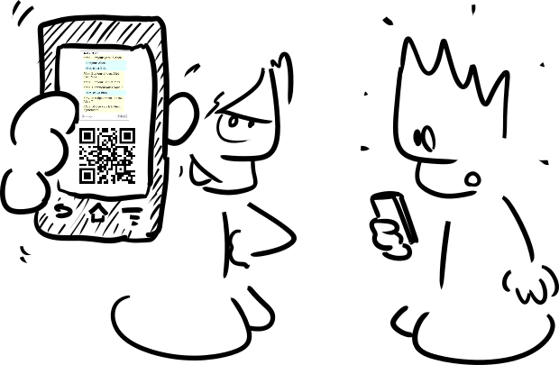

# *Action !*

Dans cette section du site, on verra comment réaliser différentes actions relatives à une application et son code source directement à partir d'un navigateur web. Le point de départ sera un encart comme celui-ci (cela peut prendre un peu de temps avant que le contenu ne s'affiche) :

<iframe style="margin: auto; border: groove 10px; padding: 5px;" src="https://replit.com/@Zelbinium/Messages?embed=true" width="500" height="360"></iframe>

Un encart donne accès à un dépôt hébergé par [*Replit*](../resources/replit/). Un tel dépôt porte le nom de *repl*. Dans le cadre de *Zelbinium*, chaque application a son propre *repl*.

L'application utilisée à titre d’exemple dans cette section permet d"échanger des messages avec n'importe qui juste en lui faisant scanner le code QR généré par l'application avec son smartphone (plus de détails seront donnés dans la sous-section [*Partager*](./share)).

  </img>
  

    Crée avec 
    <a href="https://framalab.org/gknd-creator/" target="_blank">
      <em>GéGé</em></a>.
  

Dans les sous-sections ci-dessous, on sera invité à réaliser différentes actions en utilisant les boutons présents dans l'encart en début de page. Le bouton *Open on Replit* de cet encart affiche le *repl* correspondant dans son propre onglet ; on y retrouvera les mêmes boutons que dans sa présentation ci-dessus et on peut donc utiliser indifféremment l'encart ou son affichage dans un onglet.

Voici les différentes sous-sections :

- [*Lancer*](./launch) : lancement (exécution) d'une application ;
- [*Partager*](./share) : partage de l’accès à une application ;
- [*Explorer*](./explore) : exploration du code source d'une application ;
- [*Modifier*](./modify) : modification du code source d'une application ;
- [*Créer*](./create) : création de sa propre application.

Il est conseillé de commencer par la première ([*Lancer*](./launch)), et de les parcourir dans l'ordre ci-dessus.
