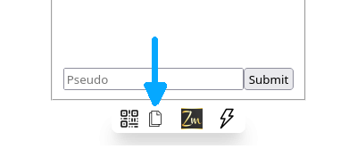

# *Action !*

Dans cette section du site, on verra comment réaliser différentes actions relatives à une application et son code source directement à partir d'un navigateur web. Le point de départ sera un encart comme celui-ci :

  
Afficher/masquer

<iframe allow="web-share" style="width: 100%; height: 80vh;" src="https://faas.q37.info/brython?demo=Messages">
</iframe>

Cliquer sur *Afficher/masquer* pour le faire apparaître.

L'application utilisée à titre d’exemple dans cette section permet d"échanger des messages avec n'importe qui juste en lui faisant scanner un [code QR](https://fr.wikipedia.org/wiki/Code_QR) ou en lui envoyant un lien généré par l'application avec son smartphone (plus de détails seront donnés ci-dessous).

  </img>
  

    Crée avec 
    <a href="https://framalab.org/gknd-creator/" target="_blank">
      <em>GéGé</em></a>.
  

Dans les sections suivantes, on sera invité à réaliser différentes actions sur l'encart en début de page. 

## Lancer une application

Pour lancer l'application, il suffit de cliquer sur le bouton *Run*. Cela va masquer l'éditeur du code source puis, au bout d'un temps variable dépendant de la complexité de l'application, l'interface de celle-ci va s'afficher. En cliquant sur *Code*, vous pouvez masquer/afficher le code source de l'application.

  
Afficher/masquer

<iframe allow="web-share" style="width: 100%; height: 80vh;" src="https://faas.q37.info/brython?demo=Messages">
</iframe>

## Partager l’accès à une application

Voyons comment partager l’accès à une application pour que plusieurs personnes puissent l'utiliser en même temps, chacun avec son propre appareil (smartphone, tablette, ordinateur personnel…).

Comme vu ci-dessus, cliquez sur *Afficher/masquer* pour afficher l'encart, puis sur le bouton *Run* pour la lancer et attendez qu'elle s'affiche.

  
Afficher/masquer

<iframe allow="web-share" style="width: 100%; height: 80vh;" src="https://faas.q37.info/brython?demo=Messages">
</iframe>

Tout en bas, les icônes suivantes vont s'afficher :

En cliquant sur l'icône pointée par la flèche, voici ce qui va s'afficher :

On aperçoit ici un [code QR](https://fr.wikipedia.org/wiki/Code_QR), pointé par la flèche. En cliquant dessus, un autre onglet va s'ouvrir qui donnera également accès à l'application. En passant d'un onglet à l'autre, on s'apercevra que les messages écrits dans un onglet seront également affichés dans l'autre onglet. Il est possible d'ouvrir simultanément plus de deux onglets.

Pour pouvoir converser avec quelqu'un à proximité, il suffit de lui faire scanner le code QR avec son appareil (smartphone, tablette…). Cela lui donnera accès à l'application. Vous pourrez ainsi échanger des messages, chacun avec son appareil.

Pour échanger des messages avec une personne qui ne peut pas scanner le code QR, soit parce qu'elle n'est pas à proximité, soit parce que ce n'est pas possible ou trop compliqué avec son appareil, il est quand même possible de lui donner accès à l'application.

Pour ce faire, il suffit de cliquer sur l'icône pointée par la flèche. S'offrira à vous alors la possibilité de partager l’accès à l'application de la même manière que vous partageriez une vidéo, une photo, un lien…

Il est possible que certains appareils, ou certains navigateurs, n'offrent pas cette possibilité de partage. Vous verrez alors ceci s'afficher : 

En cliquant sur l'icône signalée par la flèche, un lien est alors copié dans le presse-papier, facilitant son envoi, par e-mail par exemple ou n'importe quelle autre application de messagerie. En ouvrant ce lien dans son navigateur web, ce qui devrait se faire automatiquement en cliquant sur le lien, le destinataire du message pourra accéder à l'application comme s'il avait scanné le code QR.

Sur les dispositifs mobiles, il est également possible d'appuyer de manière prolongée sur le code QR pour faire apparaître un menu offrant la possibilité de partager le lien de l'application.

Toutes les fonctionnalités de partage présentées sur cette page sont automatiquement disponibles pour toutes les applications *Zelbinium*, qu'il s'agisse de celles proposées sur ce site, ou de celles que vous créerez vous-même.

## Explorer le code source d'une application

Le [code source](https://fr.wikipedia.org/wiki/Code_source) d'une application est la liste des instructions constituant cette application. Ce code source peut être découpé en plusieurs fichiers.

Pour faciliter leur manipulation, toutes les applications présentes sur ce site tiennent en un seul fichier. Il suffit de cliquer dans l'éditeur (après avoir cliquer sur *Code* si ce dernier est masqué) pour pouvoir se déplacer dans le code source et ainsi l'explorer.

  
Afficher/masquer

  <iframe allow="web-share" style="width: 100%; height: 80vh;" src="https://faas.q37.info/brython?demo=Messages">
  </iframe>

 

## Modifier le code source d'une application

Vous pouvez modifier le code source de l'application directement dans l'éditeur. En cliquant sur *Run*, ce sera la version modifiée de l'application qui sera lancée.

  
Afficher/masquer

  <iframe allow="web-share" style="width: 100%; height: 80vh;" src="https://faas.q37.info/brython?demo=Messages">
  </iframe>

 

<!--
## Créer sa propre application
-->

Pour aller plus loin, la section [*Inspiration*](../inspiration/) comporte d'autres applications que vous pourrez explorer et modifier à loisir…

