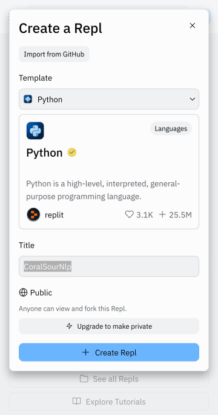
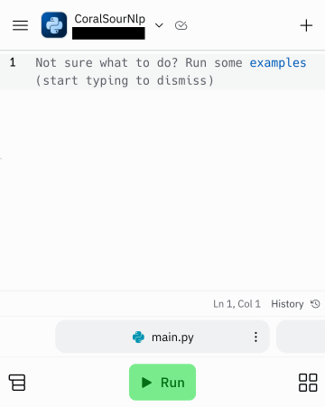

# Créer sa propre application

Créer une application dans *Replit* signifie crée un *repl* contenant les fichiers correspondant au code source de l'application.

Pour ce faire, on se rend à l'adresse https://replit.com et, si ce n'est déjà fait, on se connecte à son compte. On clique alors sur le bouton *Create Repl*, ce qui provoque l'apparition d'un *popup*.

Dans ce *popup*, on sélectionne dans le champ *Template* le langage avec lequel on désire programmer, ici *Python*, on change éventuellement le nom du *repl* dans le champ *Title*, puis on clique sur le bouton *Create Repl*.

On se retrouve alors dans l'environnement de développement, et l'on peut commencer à écrire les lignes de code de la nouvelle application et la lancer en cliquant sur le bouton *Run*.

Pour continuer, il y a sur ce site (section [*Inspiration*](../../inspiration/)) de nombreuses applications pouvant servir de base pour créer ses propres applications.