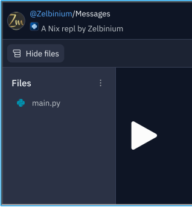
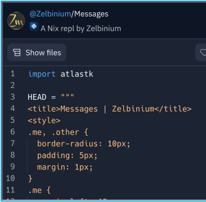

# Explorer le code source d'une application

Le [code source](https://fr.wikipedia.org/wiki/Code_source) d'une application est la liste des instructions constituant cette application. Ce code source peut être découpé en plusieurs fichiers.

<iframe style="margin: auto; border: groove 10px; padding: 5px;" src="https://replit.com/@Zelbinium/Messages?embed=true" width="500" height="360"></iframe>

En cliquant sur *Show files* (bouton <svg width="16" height="16" viewBox="0 0 24 24" fill="currentColor" aria-hidden="true" ><path fill-rule="evenodd" clip-rule="evenodd" d="M2.25 4.5C2.25 3.25736 3.25736 2.25 4.5 2.25H19.5C20.7426 2.25 21.75 3.25736 21.75 4.5V7.5C21.75 8.07627 21.5334 8.60193 21.1771 9C21.5334 9.39807 21.75 9.92373 21.75 10.5V13.5C21.75 14.0763 21.5334 14.6019 21.1771 15C21.5334 15.3981 21.75 15.9237 21.75 16.5V19.5C21.75 20.7426 20.7426 21.75 19.5 21.75H8.5C7.25736 21.75 6.25 20.7426 6.25 19.5V16.5C6.25 15.9237 6.46664 15.3981 6.82292 15C6.46664 14.6019 6.25 14.0763 6.25 13.5V10.5C6.25 10.237 6.29512 9.98458 6.37803 9.75H4.5C3.25736 9.75 2.25 8.74264 2.25 7.5V4.5ZM19.5 8.25C19.9142 8.25 20.25 7.91421 20.25 7.5V4.5C20.25 4.08579 19.9142 3.75 19.5 3.75H4.5C4.08579 3.75 3.75 4.08579 3.75 4.5V7.5C3.75 7.91421 4.08579 8.25 4.5 8.25H19.5ZM8.5 9.75C8.08579 9.75 7.75 10.0858 7.75 10.5V13.5C7.75 13.9142 8.08579 14.25 8.5 14.25H19.5C19.9142 14.25 20.25 13.9142 20.25 13.5V10.5C20.25 10.0858 19.9142 9.75 19.5 9.75H8.5ZM19.5 15.75H8.5C8.08579 15.75 7.75 16.0858 7.75 16.5V19.5C7.75 19.9142 8.08579 20.25 8.5 20.25H19.5C19.9142 20.25 20.25 19.9142 20.25 19.5V16.5C20.25 16.0858 19.9142 15.75 19.5 15.75Z"></path></svg> si le texte ne s’affiche pas, bouton <svg preserveAspectRatio="xMidYMin" width="16" height="16" viewBox="0 0 24 24" fill="currentColor" style="--size: 16px; --rotate: 0deg;" aria-hidden="true" class="css-492dz9"><path fill-rule="evenodd" d="M8.53 5.47a.75.75 0 0 1 0 1.06L3.06 12l5.47 5.47a.75.75 0 1 1-1.06 1.06l-6-6a.75.75 0 0 1 0-1.06l6-6a.75.75 0 0 1 1.06 0Zm6.94 0a.75.75 0 0 1 1.06 0l6 6a.75.75 0 0 1 0 1.06l-6 6a.75.75 0 1 1-1.06-1.06L20.94 12l-5.47-5.47a.75.75 0 0 1 0-1.06Z" clip-rule="evenodd"></path></svg> lorsque le *repl* est affiché sur sa propre page), la liste des fichiers de l'application va s'afficher. Pour l'application utilisée à titre d'exemple, il n'y a qu'un seul fichier.

Ce fichier est *main.py* (cela peut prendre quelques secondes avant qu'il ne s'affiche). Pour voir son contenu, il suffit de cliquer sur son nom. 

Il est possible que la liste des fichiers reste affichée, réduisant d'autant la zone d'affichage du fichier. Le bouton *Show files* est alors renommé en *Hide files* (si le texte est affiché). Cliquer dessus cache le panneau affichant la liste des fichiers, le fichier affiché occupant alors toute la largeur de l'encart.

La page suivante, [*Modifier*](../modify/), montre comment modifier le code source d'une application.