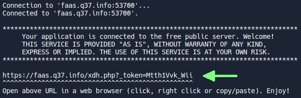

# Lancer une application

On va voir ici comment lancer une application, en l’occurrence ici une petite application permettant l'échange de messages entre plusieurs personnes.

<iframe style="margin: auto; border: groove 10px; padding: 5px;" src="https://replit.com/@Zelbinium/Messages?embed=true" width="500" height="360"></iframe>

En cliquant sur le bouton intitulé *Run*, situé en haut à droite, ou bien sur le symbole <svg preserveAspectRatio="xMidYMin" width="16" height="16" viewBox="0 0 24 24" fill="white" style="background-color: black;"><path d="M20.5929 10.9105C21.4425 11.3884 21.4425 12.6116 20.5929 13.0895L6.11279 21.2345C5.27954 21.7033 4.24997 21.1011 4.24997 20.1451L4.24997 3.85492C4.24997 2.89889 5.27954 2.29675 6.11279 2.76545L20.5929 10.9105Z"/></svg>, du texte va défiler, jusqu'à ce que ceci s'affiche :

En cliquant sur l'[URL](https://fr.wikipedia.org/wiki/Adresse_web) signalée par la flèche, un nouvel onglet va s'ouvrir qui donnera accès à l'application. On va pouvoir y saisir un pseudonyme, puis des messages qui seront visibles par toutes les personnes utilisant cette application.

L'URL affichée ne sera pas exactement la même que celle affichée ci-dessus, et elle changera à chaque fois que l'application sera relancée.

Dans certaines circonstances, cliquer sur le bouton *Run* est sans effet ; vous pourriez alors avoir à cliquer sur <svg preserveAspectRatio="xMidYMin" width="16" height="16" viewBox="0 0 24 24" fill="white" style="background-color: black;"><path d="M20.5929 10.9105C21.4425 11.3884 21.4425 12.6116 20.5929 13.0895L6.11279 21.2345C5.27954 21.7033 4.24997 21.1011 4.24997 20.1451L4.24997 3.85492C4.24997 2.89889 5.27954 2.29675 6.11279 2.76545L20.5929 10.9105Z"/></svg>.

Passons maintenant à la page [*Partager*](../share) pour voir comment partager l’accès à l'application avec d'autres personnes.

