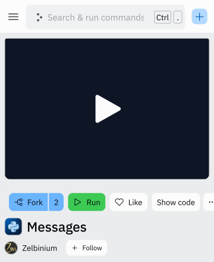
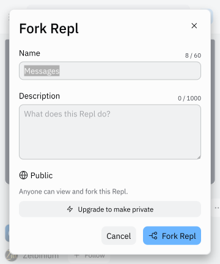
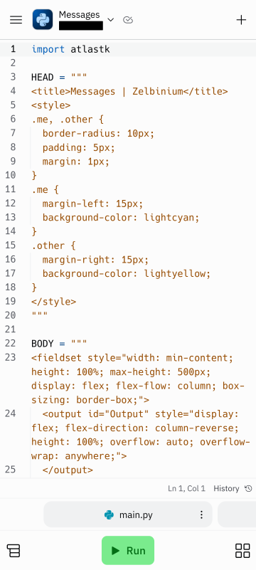

# Modifier le code source d'une application

Comme expliqué sur cette [page](../../resources/replit/), les applications sur *Replit* sont stockées dans un *repl*. Ainsi, sauf si l'on est le propriétaire du *repl*, pour modifier une application, il faut *forker* le *repl* correspondant. *Forker* consiste à faire une copie de tout le contenu d'un *repl*, de manière à pourvoir manipuler ce *repl* à volonté sans que cela ai un impact sur le *repl* d'origine.

Si ce n'est pas déjà fait, il est conseillé d'aller à l'adresse https://replit.com pour se connecter à son compte *Replit*, puis de revenir à cette page.

<iframe style="margin: auto; border: groove 10px; padding: 5px;" src="https://replit.com/@Zelbinium/Messages?embed=true" width="500" height="360"></iframe>

Pour pouvoir procéder au *fork* proprement dit, il faut cliquer sur le bouton *Open on Replit* situé en-haut à droite (ou sur le lien <a href="https://replit.com/@Zelbinium/Messages" target="_blank">https://replit.com/@Zelbinium/Messages</a>). Cela va ouvrir un nouvel onglet.

Dans ce nouvel onglet, il y un bouton libellé *Fork*. En le cliquant en étant connecté à un compte *Replit*, un *popup* va s'ouvrir dans lequel on peut changer le nom du *repl* (on peut laisser la valeur déjà présente, qui est le nom d'origine du *repl*) puis confirmer le *fork* en cliquant sur le bouton *Fork repl*.

À partir de ce moment-là, on a accès à l'environnement de développement proprement dit, dans lequel s'affiche le code source de l'application contenue dans le *repl*, code source que vous pouvez modifier à volonté, et dont vous pouvez exécuter la version modifiée en cliquant sur le bouton *Run*.

Ce site propose quantité d'applications hébergées sur *Replit* (section [*Inspiration*](../../inspiration/)) qu'il est possible de modifier comme indiqué ici.

La dernière page de cette section,  [*Créer*](../create), montre comment créer un *repl* pour y créer sa propre application.