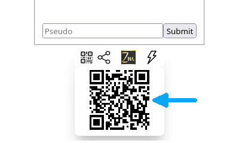
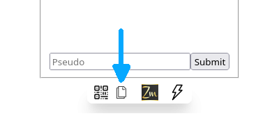

# Partager l’accès à une application

Voyons comment partager l’accès à une application  pour que plusieurs personnes puissent l'utiliser en même temps.

Comme vu à la la page [*Lancer*](../launch), lancer l'application et y accéder en cliquant sur l'URL.

<iframe style="margin: auto; border: groove 10px; padding: 5px;" src="https://replit.com/@Zelbinium/Messages?embed=true" width="500" height="360"></iframe>

Tout en bas, les icônes suivantes vont s'afficher :

En cliquant sur l'icône pointée par la flèche, voici ce qui va s'afficher :

On aperçoit ici un [code QR](https://fr.wikipedia.org/wiki/Code_QR), pointé par la flèche. En cliquant dessus, un autre onglet va s'ouvrir qui donnera également accès à l'application. En passant d'un onglet à l'autre, on s'apercevra que les messages écrits dans un onglet seront également affichés dans l'autre onglet. Il est possible d'ouvrir simultanément plus de deux onglets.

Pour pouvoir converser avec quelqu'un à proximité, il suffit de lui faire scanner le code QR avec son appareil (smartphone, tablette…). Cela lui donnera accès à l'application. Vous pourrez ainsi échanger des messages, chacun avec son appareil.

Pour échanger des messages avec une personne qui ne peut pas scanner le code QR, soit parce qu'elle n'est pas à proximité, soit parce que ce n'est pas possible ou trop compliqué avec son appareil, il est quand même possible de lui donner accès à l'application.

Pour ce faire, il suffit de cliquer sur l'icône pointée par la flèche. S'offrira à vous alors la possibilité de partager l’accès à l'application de la même manière que vous partageriez une photo ou un lien.

Il est possible que certains appareils, ou certains navigateurs, n'offrent pas cette possibilité de partage. Vous verrez alors ceci s'afficher : 

En cliquant sur l'icône signalée par la flèche, un lien est alors copié dans le presse-papier, facilitant son envoi, par e-mail par exemple ou n'importe quelle autre application de messagerie. En ouvrant ce lien dans son navigateur web, ce qui devrait se faire automatiquement en cliquant sur le lien, le destinataire du message pourra accéder à l'application comme s'il avait scanné le code QR.

En relançant l'application, son lien va changer, et il faudra donc à nouveau scanner le code QR correspondant ou envoyer le nouveau lien.

Toutes les fonctionnalités de partage présentées sur cette page sont automatiquement disponibles pour toutes les applications *Zelbinium*, qu'il s'agisse de celles proposées sur ce site, ou de celles que vous créerez vous-même.

Passons maintenant à la page [*Explorer*](../explore/) pour voir comment visualiser le [code source](https://fr.wikipedia.org/wiki/Code_source) d'une application.
