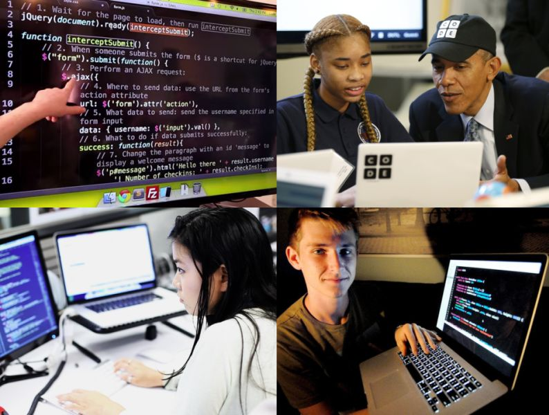

# Pourquoi faire un don ?

Avec *Zelbinium*, vos enfants peuvent s'amuser à créer, avec leur smartphone, de véritables [applications connectées](https://fr.wikipedia.org/wiki/Application_web). En passant ainsi moins de temps sur les média sociaux et en utilisant ces derniers, grâce aux facilités de partage offerts par *Zelbinium*, pour échanger au sujet de leurs réalisations, vos enfants seront moins exposés aux [dérives](https://fr.wikipedia.org/wiki/Cyberharc%C3%A8lement) aux conséquences trop souvent dramatiques qui font la une des journaux.

*Zelbinium* ne pourrait exister sans le [*toolkit* *Atlas*](../resources/atk/), une innovation française dans le domaine du *cloud computing*. Vos dons seront prioritairement affectés au financement des ressources nécessaires pour consolider la qualité du service. Le surplus sera consacré à l'amélioration de ce site, dans sa forme et son contenu, afin d'offrir aux jeunes l'opportunité d'acquérir une meilleure compréhension et une meilleure maîtrise du numérique ainsi que de nouvelles perspectives pour leur avenir professionnel.

Pour vos questions : [page de contact](../contact).

  <table style="display: inline-block; align-content: center;">
    <tr>
      <td style="border: none; padding: 0px; padding-right: 10px;">
        <b>Soutenez <em>Zelbinium</em></b> : 
      </td>
      <td>
        
        <noscript>
          <a href="https://liberapay.com/Epeios/donate">
          
        </noscript>
        </a>
      </td>
      <td style="vertical-align: middle;">
        <a style="display: flex;" href="https://github.com/sponsors/epeios-q37">
          </img>
        </a>
      </td>
      <td>
        <a href="https://donate.stripe.com/7sIcOq9Cm7sc5RS000">
          stripe
        </a>
      </td>
      <td style="vertical-align: middle;">
        <a style="display: flex;" href="https://www.kisskissbankbank.com/fr/projects/zelbinium">
          </img>
        </a>
      </td>
    </tr>
  </table>

