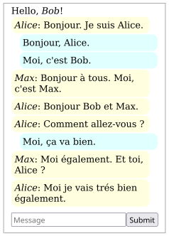
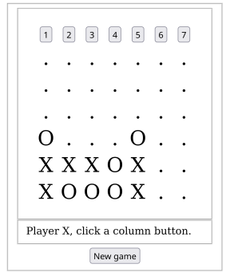
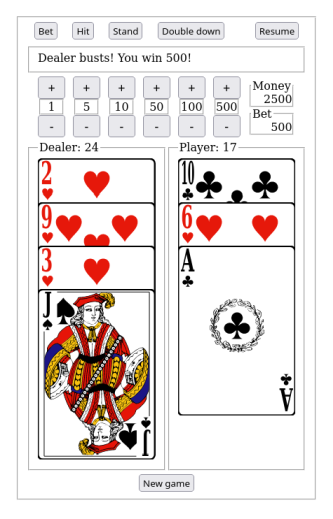
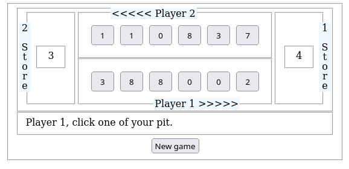
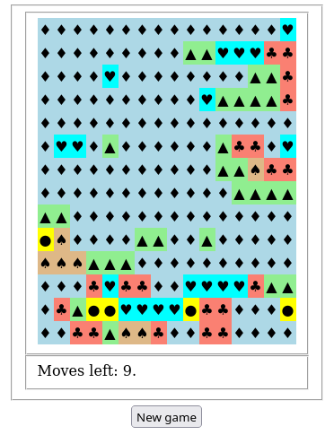

# Inspiration

Voici quelques applications dont beaucoup sont des jeux, certains pouvant se jouer à plusieurs.  L'ensemble de ces applications sont regroupées dans le dépôt à l'adresse <https://github.com/epeios-q37/zelbinium>. Le terme entre parenthèses est le nom du dossier dans lequel se situe le code source de chaque application.

En cliquant sur l'aperçu d'une application, vous aurez accès à son *repl*, à partir duquel l'application pourra être [lancée](../action/launch), [partagée](../action/share), [explorée](../action/explore), [modifiée](../action/modify) et servir d'inspiration pour [créer](../action/create) ses propres applications, comme détaillé dans la section [*Action !*](../action/).

## *Messages* (`Messages`)

Il s'agit de l"application utilisée dans la section [*Action !*](../action/). Elle permet l'échange de messages entre tous les appareils connectés à la même application.

## *Puissance 4* (`FourInARow`)

Le jeu [*Puissance 4*](https://fr.wikipedia.org/wiki/Puissance_4).

## *Blackjack* (`Blackjack`)

Le jeu du [*blackjack*](https://fr.wikipedia.org/wiki/Blackjack_(jeu)).

## *Mancala* (`Mancala`)

Un ancien jeu de semis à deux joueurs de type [*mancala*](https://fr.wikipedia.org/wiki/Mancala).

Prenez les graines dans un emplacement de votre côté et placez-en une dans chaque emplacement suivant, dans le sens inverse des aiguilles d'une montre et en sautant la réserve de votre adversaire. Si votre dernière graine atterrit dans un emplacement vide, déplacez les graines de l'emplacement opposé dans votre réserve. Le but est d'obtenir le plus grand nombre de graines dans votre réserve sur le côté du plateau. Si la dernière graine placée se retrouve dans votre réserve, vous bénéficiez d'un tour gratuit.

## *Flood it!* (`Flooder`)

Définissez le motif de la zone supérieure gauche, qui remplit tous les carrés adjacents de ce motif, en sélectionnant un carré du motif souhaité. Essayez de faire en sorte que la surface entière ai le même motif.

