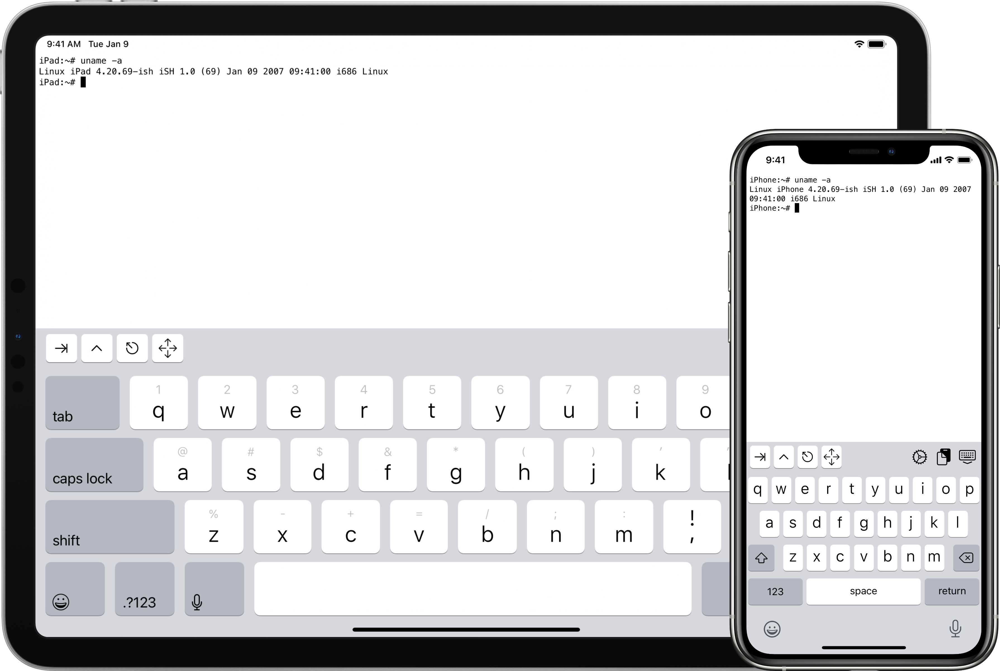

# *iSH*

[*iSH*](https://ish.app/) est un *shell* *Linux* pour *iOS* (et dérivés) qui permet d'installer un interpréteur *Python*.  On peut ainsi directement exécuter ses applications *Python* directement sur son *iPhone* ou *iPad* sans avoir à utiliser *Replit*.

Si vous disposez d'un ordinateur personnel, vous pouvez y installer un environnement de développement *Python* pour développer vos applications, et la déposer dans une [forge logicielle](../forges) pour facilement la récupérer et l'exécuter sur votre smartphone ou tablette *Apple* grâce à *iSH*.

[*Termux*](../termux) est l'équivalent pour les smartphones et tablettes sous *Android*.