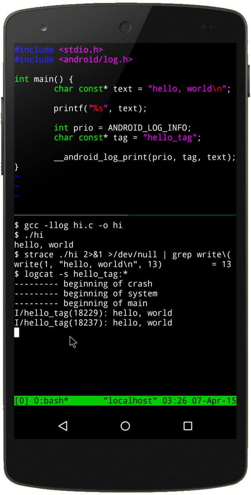

# *Termux*

[*Termux*](https://termux.dev/) est un émulateur de terminal pour *Android* dans lequel on peut installer un interpréteur *Python*. On peut ainsi directement exécuter ses programmes *Python* directement sur son smartphone ou sa tablette *Android* sans avoir à utiliser *Replit*.

