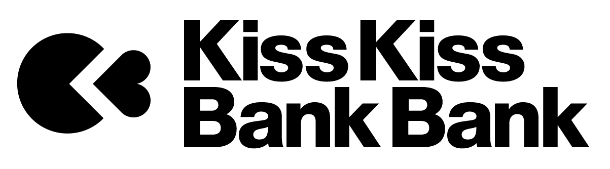

<!--
  Si URL modifiée, mettre à jour raccourci 'kfn7b7xw'.
-->

# Votre soutien fait la différence

 

Avec *Zelbinium*, vos enfants utiliseront leur smartphone pour créer des contenus originaux qu'ils pourront facilement partager via les médias sociaux, limitant ainsi leur exposition aux contenus trop souvent inappropriés propagés par ces derniers.

 

  <table style="padding: 15px; border-radius: 10px; box-shadow: rgba(0, 0, 0, 0.56) 0px 22px 70px 4px;width: fit-content; margin: auto;">
    <tr>
      <td colspan="2" style="border: none; text-align: center;">
        <b>Soutenez <em>Zelbinium</em></b> : 
      </td>
    </tr>
    <tr>
      <td>
        
        <noscript>
          <a href="https://liberapay.com/Epeios/donate">
          
        </noscript>
        </a>
      </td>
      <td style="vertical-align: middle;">
        <a style="display: flex;" href="https://github.com/sponsors/epeios-q37">
          </img>
        </a>
      </td>
    </tr>
    <tr>
      <td>
        <a href="https://donate.stripe.com/7sIcOq9Cm7sc5RS000">
          stripe
        </a>
      </td>
      <td style="vertical-align: middle;">
        <a style="display: flex;" href="https://www.kisskissbankbank.com/fr/projects/zelbinium">
          </img>
        </a>
      </td>
    </tr>
  </table>

 

---

Craignez-vous que votre enfant ne passe trop de temps sur son smartphone ? Redoutez-vous une dépendance ou que cela ne l'expose à ces [dérives](https://fr.wikipedia.org/wiki/Cyberharc%C3%A8lement) aux conséquences trop souvent dramatiques qui font la une des journaux ?

*Zelbinium* est le moyen le plus facile pour vos enfants de créer de véritables [applications connectées](https://fr.wikipedia.org/wiki/Application_web), accessibles via un [code QR](https://fr.wikipedia.org/wiki/Code_QR) ou un simple lien transmis par messagerie [électronique](https://fr.wikipedia.org/wiki/Courrier_%C3%A9lectronique) ou [instantanée](https://fr.wikipedia.org/wiki/Messagerie_instantan%C3%A9e).

Ces applications sont utilisables <u>sur</u> smartphone, et peuvent être crées <u>avec</u> un smartphone, ce qui rend *Zelbinium* particulièrement attractif pour les jeunes, les poussant à passer moins de temps sur les jeux vidéos ou les media sociaux. Contrairement à ces derniers, *Zelbinium* stimule la créativité de vos enfants et ne présente donc pas les mêmes risques d'addiction.

En outre, en rendant leurs réalisations facilement accessibles via les média sociaux, *Zelbinium* change également la nature des échanges qu'entretiennent nos enfants et en assainira le contenu, réduisant les risques de cyberharcèlement.

Le [langage utilisé dans *Zelbinium*](https://fr.wikipedia.org/wiki/Python_(langage)) est très répandu dans le milieu professionnel, et c'est également celui préconisé par l'Éducation nationale. Les connaissances acquises avec *Zelbinium*, vos enfants pourront les utiliser en-dehors de *Zelbinium*, que ce soit durant leurs études, ou au cours de leur future vie professionnelle.

*Zelbinium* s'appuie également sur les [technologies du web](https://fr.wikipedia.org/wiki/HTML5), technologies extrêmement répandues et abondamment documentées, capables de gérer images, sons, vidéos, musiques, animations… De ce fait, *Zelbinium* permettra également à vos enfants de laisser libre cours à leur créativité dans d'autres domaines que la programmation.

Plusieurs enfants pourront ainsi travailler ensemble sur la même application. Selon leurs affinités, certains s'occuperont de la programmation, d'autres de la partie sonore, d'autres encore du graphisme… leur permettant de découvrir le travail en équipe tout en s'amusant.

Grâce à *Zelbinium*, vos enfants développeront des compétences en programmation ainsi qu'une maîtrise du numérique en général, tout en renforçant leurs liens avec leurs camarades par le travail en groupe.

Face à l'omniprésence du numérique, les connaissances ainsi acquises serviront à vos enfants autant dans leur vie personnelle que professionnelle, que leur métier soit ou non directement lié à l'informatique.

Ce qui le rend unique, c'est la facilité avec laquelle *Zelbinium* permet de créer et partager des applications adaptées aux smartphones et permettant facilement à ses utilisateurs, chacun à partir de son propre smartphone, d'interagir.

Cette particularité de *Zelbinium* n'est possible que grâce à l'utilisation du [*toolkit* *Atlas*](https://atlastk.org/), une innovation française de dimension mondiale dans le domaine du cloud computing, disponible sous [licence libre](https://fr.wikipedia.org/wiki/Logiciel#Philosophie_libre).

Ce site montre, au travers de sa section [*Action !*](../action/), comment, en quelques clics, lancer, partager, explorer, modifier et créer une application à partir de son smartphone.

La section [*Inspiration*](../inspiration/) de ce même site donne des exemples d'applications directement accessibles et modifiables en suivant les indications de la section *Action !*.

Toutes les applications présentes sur *Zelbinium* sont accessibles sur smartphone, mais également sur tablette et ordinateur personnel. Aucune raison de ne pas se se lancer dés à présent !

Ingénieur logiciel, j'ai développé le toolkit *Atlas* sur mon temps libre mais mes compétences, essentiellement techniques, mes disponibilités et mes moyens financiers n'y suffisent plus. Entre la location des serveurs et de la bande passante, les ressources nécessaires pour faire connaître le projet ainsi que pour définir et mettre au point les outils facilitant l'utilisation de *Zelbinium* dans des actions à destination des jeunes… votre soutien est juste indispensable pour pérenniser et développer *Zelbinium*.

Vous pouvez également contribuer en faisant connaître *Zelbinium* autour de vous, notamment à ceux qui interviennent auprès de vos enfants. Ce projet est également l'occasion de partager des moments de complicité avec votre enfant, en l'accompagnant dans sa découverte de *Zelbinium*.

D'autres projets dédiés à l'inclusion numérique sont actuellement à l'étude, qui ne sont possibles que grâce au service au cœur de *Zelbinium*, car rien d'équivalent n'existe au monde.

Dés à présent, construisons ensemble un environnement numérique plus sain pour nos enfants et offrons-leur de nouvelles perspectives professionnelles dans un domaine en pleine expansion.

  
    <a style="margin: auto; background-color: white; color: green; border-radius: 20px; font-family: sans-serif; font-weight: bold; padding: 5px 30px; margin: 10px auto" href="#support">
      Soutenez <em>Zelbinium</em> !
    </a>
  

